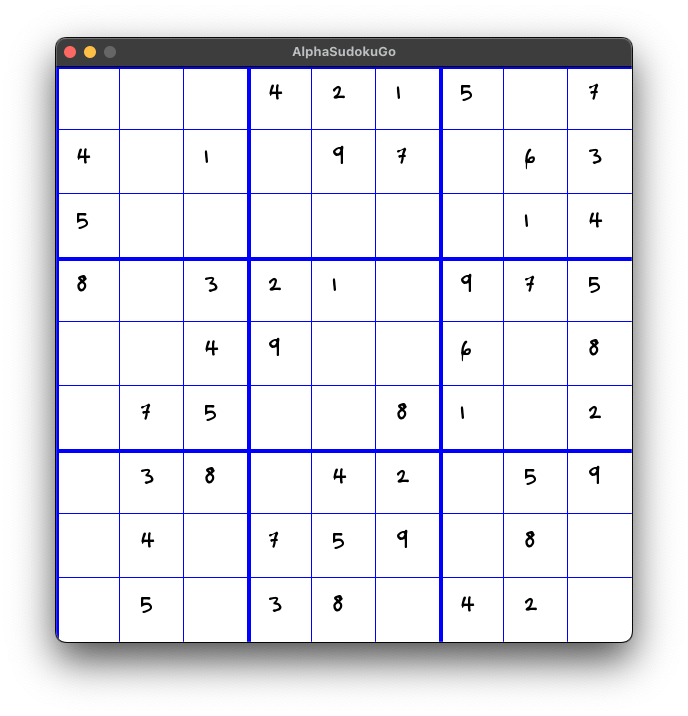

# AlphaSudokuGo

This project takes a Constraint Satisfaction Problem (CSP) approach, implementing backtracking and consistency checks to solve Sudoku puzzles of any difficulty level.



## Features 🔢

- **Constraint Satisfaction Problem (CSP) Solver**: Leverages the CSP approach for solving puzzles, ensuring that all constraints are met before moving forward. Includes consistency checks to ensure that the puzzle is solvable.
- **Backtracking Algorithm**: Implements a backtracking algorithm to navigate through the puzzle, making intelligent decisions at each step.
- **Efficient Puzzle Solving**: Designed to solve puzzles of varying difficulty levels, from simple to diabolically hard.
- **Qt5 GUI**: Provides a graphical user interface for users to interact with the solver and input their own puzzles.
- **CMake Build System**: Uses CMake to manage the build process, making it easy to compile and run the project. Works on Windows, macOS, and Linux.

## Getting Started

### Prerequisites

To compile and run AlphaSudokuGo, you will need:

- A C++ compiler that supports C++11 or later.
- A clone of this repository.
- Qt5 (optional, for the GUI).
- CMake (optional, for building the project).
- A terminal or command prompt.

### Compilation

Navigate to the project directory and compile the project using the following commands:

```bash
mkdir build && cd build
cmake ..
make
```

Than you can run the project using the following command:

```bash
./SudokuGame
```
