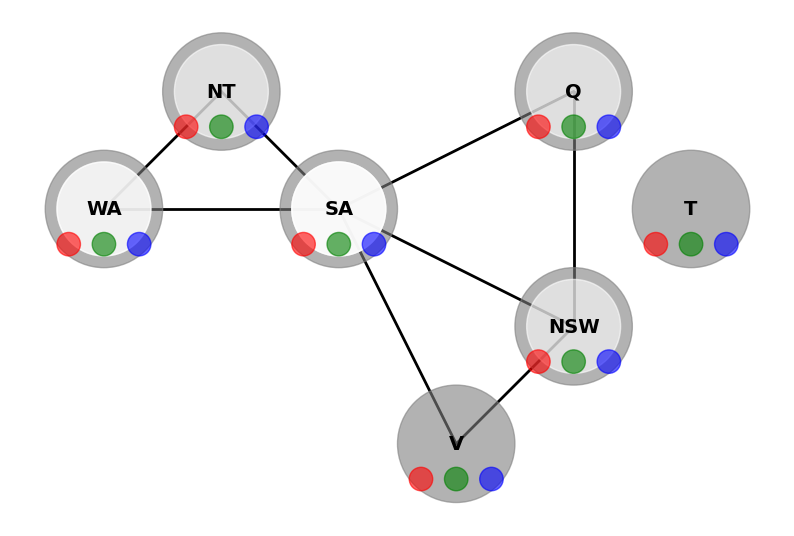

# AlphaSudokuGo

AlphaSudokuGo is C++ program that solves Sudoku puzzles using a Constraint Satisfaction Problem (CSP) approach. It includes a graphical user interface (GUI) built with Qt5, allowing users to input their own puzzles and watch the solver in action. This project aim to demonstrate the power of Artificial Intelligence (AI) and Constraint Satisfaction Problems (CSP) in solving complex puzzles.

<p align="center">
    

## Background 📚

A constraint satisfaction problem (CSP) is a problem defined by a tuple $(X, D, C)$, where: $X$ is a set of variables, $D$ is a set of domains, and $C$ is a set of constraints. The goal is to assign a value to each variable such that the constraints are satisfied. CSPs are a special kind of problem that can be solved by search algorithms. They are used in many areas of artificial intelligence (AI), including scheduling, planning, and decision making.

A more simple example of a CSP is the Australian map-coloring problem. In this problem, the goal is to assign a color to each region of Australia such that no two adjacent regions have the same color. This problem can be represented as a CSP with four variables (one for each region) and three constraints (one for each pair of adjacent regions). The goal is to find an assignment of colors to the regions that satisfies all of the constraints.

<p align="center">
    
    
    <br>
  <i>Australian map-coloring problem initial state (left) and a goal state (right)</i>
</p>

As can be implamented in the [examples.ipynb](./examples.ipynb) file, the CSP in this case consist of the following components:

- Variables: A set of variables, each of which represents a region of Australia ($X = \{WA, NT, Q, NSW, V, SA, T\}$).
- Domains: A set of domains, each of which contains the possible colors that a region can be assigned ($D = \{red, green, blue\}$).
- Constraints: A set of constraints, each of which specifies the allowable combinations of colors for a pair of adjacent regions ($C = \{(WA, NT), (WA, SA), (NT, SA), (NT, Q), (SA, Q), (SA, NSW), (SA, V), (NSW, Q), (NSW, V)\}$). Note that an unary constraint is also applied to each variable, which enforce that each region must be assigned a color.

The basic idea of a CSP is to search for a solution that satisfies all of the constraints. The search space for a CSP is defined by the possible assignments of values to the variables. The search algorithms used to solve CSPs are designed to explore this search space in an efficient manner.

The way the search is performed is by using a backtracking algorithm, which is a general algorithm for finding all (or some) solutions to some computational problems, notably constraint satisfaction problems, that incrementally builds candidates to the solutions, and abandons a candidate ("backtracks") as soon as it determines that the candidate cannot possibly be completed to a valid solution.

If at any point the algorithm finds that a variable has no possible values left in its domain, the algorithm backtracks to the most recent variable that has a value that can be changed. This process continues until a solution is found or it is determined that no solution exists.

<p align="center">
    
    <br>
  <i>Backtracking with AC-3 Algorithm</i>
</p>

There are couple of ways to improve the backtracking algorithm, one of them is to use the AC-3 algorithm, which is a simple and widely used algorithm for enforcing arc consistency in a CSP. The basic idea of the AC-3 algorithm is to iteratively remove values from the domains of the variables in a CSP until the CSP is arc consistent. This is done by checking each constraint in the CSP and removing values from the domains of the variables that do not satisfy the constraint. The AC-3 algorithm is used to preprocess the CSP before the backtracking algorithm is applied, in order to reduce the size of the search space and improve the efficiency of the backtracking algorithm.

## Sudoku

The Sudoku puzzle is a classic example of a CSP. It consists of a 9x9 grid of cells, where each cell can contain a value from 1 to 9. The goal is to fill in the grid such that each row, column, and 3x3 subgrid contains the numbers 1 to 9 without any repeats. This can be represented as a CSP with 81 variables (one for each cell), 81 domains (each containing the numbers 1 to 9), and 27 constraints (9 for the rows, 9 for the columns, and 9 for the subgrids).

I first encounter the Sudoku puzzle in the LeetCode problem [Sudoku Solver](https://leetcode.com/problems/sudoku-solver/), which is considered as 'Hard' problem. The problem is to write a program to solve a Sudoku puzzle by filling the empty cells. A sudoku solution must satisfy all of the rules we mentioned above.

## Features 🔢

- **Constraint Satisfaction Problem (CSP) Solver**: Leverages the CSP approach for solving puzzles, ensuring that all constraints are met before moving forward. Includes consistency checks to ensure that the puzzle is solvable.
- **Backtracking Algorithm**: Implements a backtracking algorithm to navigate through the puzzle, making intelligent decisions at each step.
- **Efficient Puzzle Solving**: Designed to solve puzzles of varying difficulty levels, from simple to diabolically hard.
- **Qt5 GUI**: Provides a graphical user interface for users to interact with the solver and input their own puzzles.
- **CMake Build System**: Uses CMake to manage the build process, making it easy to compile and run the project. Works on Windows, macOS, and Linux.

## Getting Started

### Prerequisites

To compile and run AlphaSudokuGo, you will need:

- A C++ compiler that supports C++11 or later.
- A clone of this repository.
- Qt5 (optional, for the GUI).
- CMake (optional, for building the project).
- A terminal or command prompt.

### Compilation

Navigate to the project directory and compile the project using the following commands:

```bash
mkdir build && cd build
cmake ..
make
```

Than you can run the project using the following command:

```bash
./SudokuGame
```
